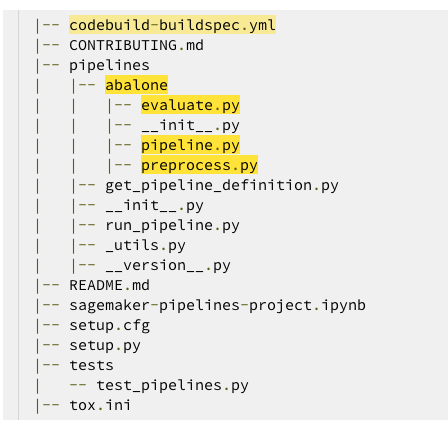

# ML custom model to the project
----------

After your project has been created, the architecture described earlier is deployed and the visualization of the pipeline is available on the Pipelines drop-down menu within SageMaker Studio.

To modify the sample code from this launched template, we first need to clone the CodeCommit repositories to our local SageMaker Studio instance. From the list of projects, choose the one that was just created. On the Repositories tab, you can select the hyperlinks to locally clone the CodeCommit repos.

## Model Build Repository

The ModelBuild repository contains the code for preprocessing, training, and evaluating the model. The sample code trains and evaluates a model on the UCI Abalone dataset . We can modify these files to solve our own customer churn use case. See the following code:

Now, let's modify the code by following delow