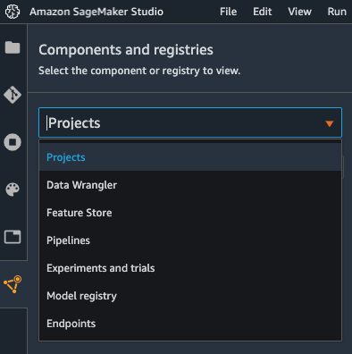
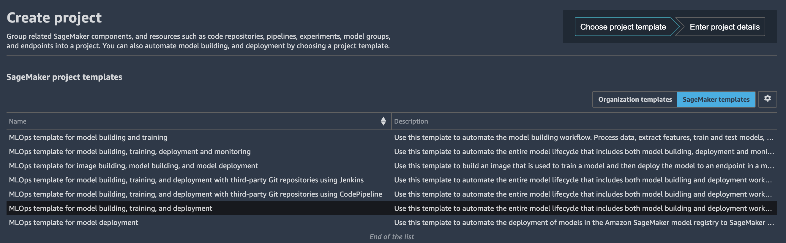
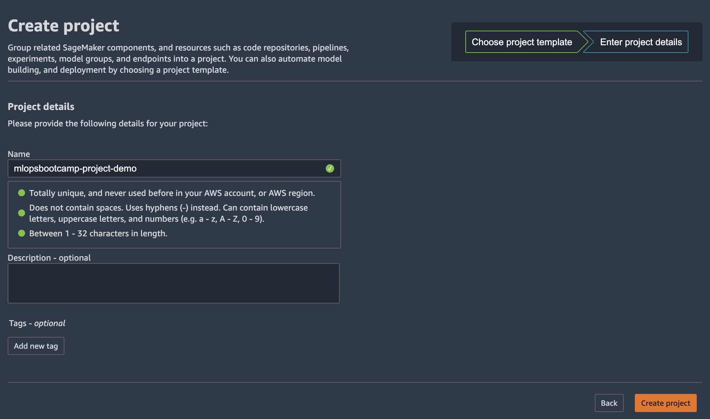

# MLOps Template
----------

We start by taking a detailed look at what AWS services are launched when this build, train, and deploy MLOps template is launched. Later, we discuss how to modify the skeleton for a custom use case.

In SageMaker Studio, you can now choose the Projects menu on the Components and registries menu.

Once you choose Projects, click on Create project

On the projects page, you can launch a preconfigured SageMaker MLOps template. For this lab, we choose MLOps template for model building, training, and deployment and click on Select project template

In the next page provide Project Name and short Description and select Create Project.

The project will take a while to be created.

Launching this template starts a model building pipeline by default, and while there is no cost for using SageMaker Pipelines itself, you will be charged for the services launched. Cost varies by Region.

After the project is created from the MLOps template, the following architecture is deployed.

Included in the architecture are the following AWS services and resources:

* The MLOps templates that are made available through SageMaker projects are provided via an AWS Service Catalog  portfolio that automatically gets imported when a user enables projects on the Studio domain.

* Two repositories are added to AWS CodeCommit :

 * The first repository provides scaffolding code to create a multi-step model building pipeline including the following steps: data processing, model training, model evaluation, and conditional model registration based on accuracy. As you can see in the pipeline.py file, this pipeline trains a linear regression model using the XGBoost algorithm on the well-known UCI Abalone dataset . This repository also includes a build specification file , used by AWS CodePipeline  and AWS CodeBuild  to run the pipeline automatically.

 * The second repository contains code and configuration files for model deployment, as well as test scripts required to pass the quality gate. This repo also uses CodePipeline and CodeBuild, which run an AWS CloudFormation  template to create model endpoints for staging and production.

* Two CodePipeline pipelines:

 * The ModelBuild pipeline automatically triggers and runs the pipeline from end to end whenever a new commit is made to the ModelBuild CodeCommit repository.

 * The ModelDeploy pipeline automatically triggers whenever a new model version is added to the model registry and the status is marked as Approved. Models that are registered with Pending or Rejected statuses aren’t deployed.

* An Amazon Simple Storage Service  (Amazon S3) bucket is created for output model artifacts generated from the pipeline.

* SageMaker Pipelines uses the following resources: 

 * This workflow contains the directed acyclic graph (DAG) that trains and evaluates our model. Each step in the pipeline keeps track of the lineage and intermediate steps can be cached for quickly re-running the pipeline. Outside of templates, you can also create pipelines using the SDK .

 * Within SageMaker Pipelines, the SageMaker model registry  tracks the model versions and respective artifacts, including the lineage and metadata for how they were created. Different model versions are grouped together under a model group, and new models registered to the registry are automatically versioned. The model registry also provides an approval workflow for model versions and supports deployment of models in different accounts. You can also use the model registry through the boto3 package .

* Two SageMaker endpoints:

 * After a model is approved in the registry, the artifact is automatically deployed to a staging endpoint followed by a manual approval step.

 * If approved, it’s deployed to a production endpoint in the same AWS account.

All SageMaker resources, such as training jobs, pipelines, models, and endpoints, as well as AWS resources listed in this lab, are automatically tagged with the project name and a unique project ID tag.